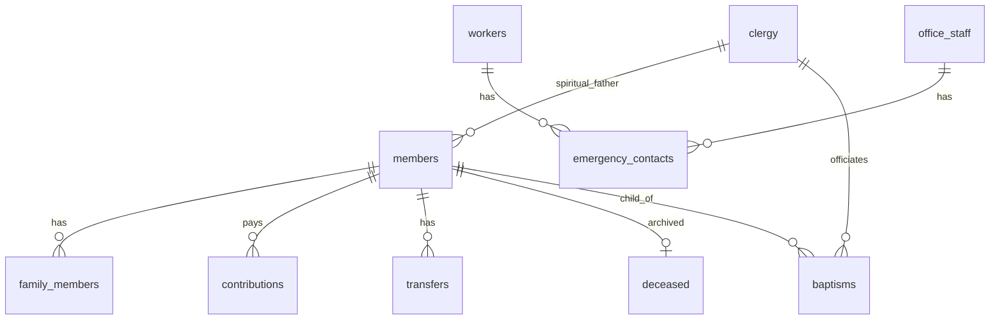

# Database Schema — Saint George MMS

PostgreSQL 16, UTF-8, managed exclusively by **Flyway** (`ddl-auto: validate`).

## System tables

### users
| Column | Type | Notes |
|--------|------|-------|
| user_id | BIGSERIAL PK | |
| username | VARCHAR(60) UNIQUE | |
| password_hash | VARCHAR(255) | bcrypt |
| full_name | TEXT | |
| role | VARCHAR(20) | ADMIN, RECORDER, VIEWER |
| is_active | BOOLEAN | default true |
| created_at | TIMESTAMP | |

### audit_log
| Column | Type | Notes |
|--------|------|-------|
| log_id | BIGSERIAL PK | |
| user_id | BIGINT FK → users | nullable for system |
| action | VARCHAR(20) | CREATE, UPDATE, DELETE |
| module | VARCHAR(60) | module_key |
| record_id | BIGINT | |
| old_data | JSONB | snapshot before change |
| new_data | JSONB | snapshot after change |
| created_at | TIMESTAMP | |

### form_field_definitions
| Column | Type | Notes |
|--------|------|-------|
| id | BIGSERIAL PK | |
| module_key | VARCHAR(60) | |
| field_key | VARCHAR(100) | UNIQUE per module |
| label_am | TEXT | required |
| label_en | TEXT | |
| field_type | VARCHAR(30) | TEXT, TEXTAREA, NUMBER, DATE, DROPDOWN, PHOTO, BOOLEAN |
| dropdown_opts | JSONB | array of strings |
| validation_rules | JSONB | min/max length, min/max value, dates |
| is_required | BOOLEAN | |
| is_active | BOOLEAN | |
| is_system_core | BOOLEAN | undeletable in admin UI (R-07) |
| sort_order | INTEGER | |
| created_at | TIMESTAMP | |

### record_custom_fields
| Column | Type | Notes |
|--------|------|-------|
| id | BIGSERIAL PK | |
| module_key | VARCHAR(60) | |
| record_id | BIGINT | polymorphic FK to module PK |
| field_key | VARCHAR(100) | |
| field_value | TEXT | photos store file path |
| created_at | TIMESTAMP | UNIQUE (module_key, record_id, field_key) |

## Core domain tables

### members
| Column | Type | Notes |
|--------|------|-------|
| member_id | BIGSERIAL PK | system-wide FK |
| full_name | TEXT NOT NULL | |
| phone | VARCHAR(40) | |
| photo_path | VARCHAR(500) | file reference |
| kebele | VARCHAR(120) | |
| clergy_id | BIGINT FK → clergy | spiritual father |
| registered_date | DATE | |
| is_active | BOOLEAN | false when transferred/deceased |
| status | VARCHAR(30) | ACTIVE, TRANSFERRED, DECEASED |
| second_member | JSONB | dual registration (FR-B01) |
| created_at / updated_at | TIMESTAMP | |

### clergy
| clergy_id PK | full_name, role_type, phone, address, photo_path, is_active |

### baptisms
| baptism_id PK | member_id FK, child_name, baptism_date, officiating_clergy_id FK, church_name |

### family_members
| family_id PK | member_id FK, relationship_type, full_name, age |

### staff_ministers
| staff_id PK | full_name, gender, phone, hire_date, employment_type, member_id FK |

### office_staff
| office_id PK | full_name, position, phone, member_id FK, clergy_id FK |

### workers
| worker_id PK | full_name, phone, job_role, gender |

### emergency_contacts
| contact_id PK | full_name, phone, address, worker_id FK, office_id FK |

### parish_council
| council_id PK | full_name, position, phone, clergy_id FK |

### contributions
| contrib_id PK | member_id FK, amount DECIMAL(12,2), receipt_no UNIQUE, ethiopian_year INT, payment_date |

### transfers
| transfer_id PK | member_id FK, reason, region, diocese, woreda, transfer_date |

### deceased
| deceased_id PK | member_id FK, death_date, kebele, gender, full_name_display |

### sunday_school
| ss_id PK | full_name, phone, birth_date, gender, member_id FK, clergy_id FK |

### abnet_school
| abnet_id PK | full_name, phone, birth_date, gender, member_id FK, clergy_id FK |

## Indexes (performance NFR-01, NFR-12)

- `members(full_name)`, `members(phone)`, `members(kebele)`, `members(clergy_id)`
- `record_custom_fields(module_key, record_id)`
- `audit_log(created_at DESC)`, `audit_log(module, record_id)`
- `contributions(member_id)`, `contributions(ethiopian_year)`

## ER overview

SQL source of truth: `backend/src/main/resources/db/migration/`.
